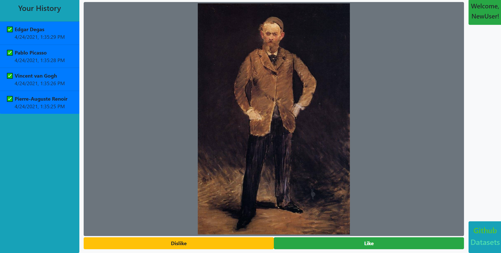

# CSCE 489 Art Recommender

### Bringing Art to the Modern Engineering Student

_Aggies Recommending Truly Stylish Unique Curated Kitschy Stuff_ (ART SUCKS) is a web based art browsing tool which aims to help artistically deprived engineering students gain a deeper appreciation for artwork by presenting humanity's greatest works of all time in a comfortable, familiar format. 

## How it works

The ART SUCKS recommender is an ensemble recommender system which uses both Content- and Temporally-based methods to recommend images to the user. 

### Frontend

The frontend will be built using React and Bootstrap running on a standalone frontend server. It will communicate with the backend only over APIs. Create-react-app was used as a jumping off point, more information is available at https://github.com/facebook/create-react-app

### Backend

The backend will be built on Django using the default Django project and app structure.

### Hosting

The site will be hosted using DigitalOcean's free $100 credit/2 month trial.

The site can be accessed at [http://104.236.113.146:3000](http://104.236.113.146:3000).

### Feature generation

This will be done with some magic function involving CNNs.

### A note on running locally
Due to a number of recent changes to the project stucture, running the this app on a local machine for testing/development is no longer a viable solution. For example, the database has been migrated from an sqlite3 database (which is stored as a simple file) to a full on MySQL database which needs to be hosted along with the app's frontend and backend servers. Beyond this, the images are not hosted in the repository due to their size and would have to be downloaded and placed in the backend/static/images folder manually after correcting the odd characters in the Albrecht Durer works. Beyond this, the MySQL database needs to be loaded up with the invidual artworks from a csv import due to the size of the json objects. While the scripts to do this are present in the auxillary directory, this is not recommended due to the relative difficulty of getting everything up and running locally.

### Sources/Libraries
* create-react-app - https://github.com/facebook/create-react-app
* tutorial: https://www.digitalocean.com/community/tutorials/build-a-to-do-application-using-django-and-react
* tutorial: https://www.youtube.com/watch?v=Ke90Tje7VS0&t=1542s
* tutorial: https://simpleisbetterthancomplex.com/tutorial/2018/11/22/how-to-implement-token-authentication-using-django-rest-framework.html
* https://nemecek.be/blog/23/how-to-createregister-user-account-with-django-rest-framework-api
* https://stackoverflow.com/questions/20555673/django-query-get-last-n-records
* https://stackoverflow.com/questions/32679945/django-rest-framework-custom-post-permissions
* https://hakibenita.medium.com/how-to-add-custom-action-buttons-to-django-admin-8d266f5b0d41
* https://stackoverflow.com/questions/10607688/how-to-create-a-file-name-with-the-current-date-time-in-python
